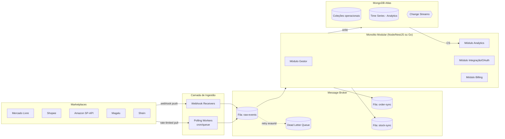
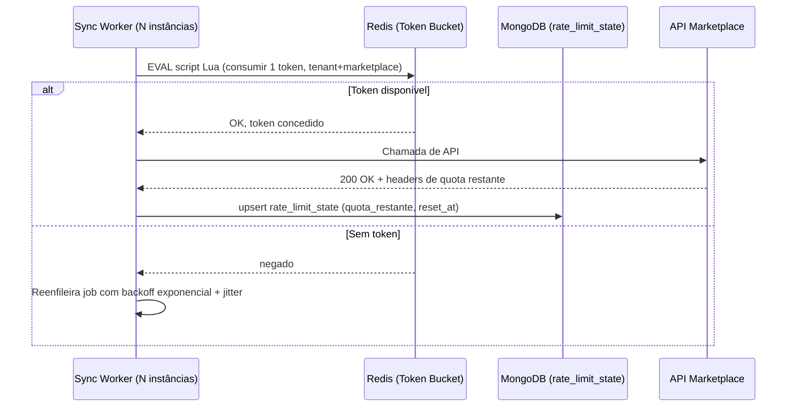
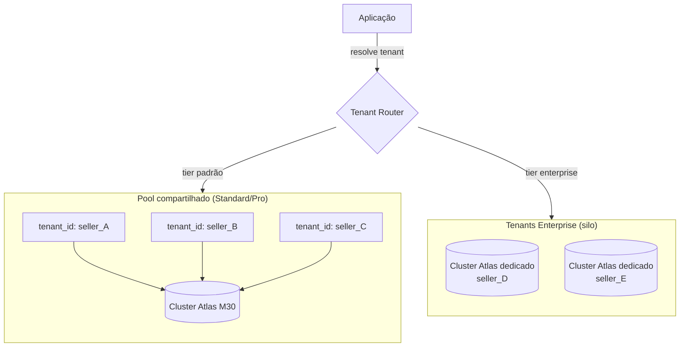
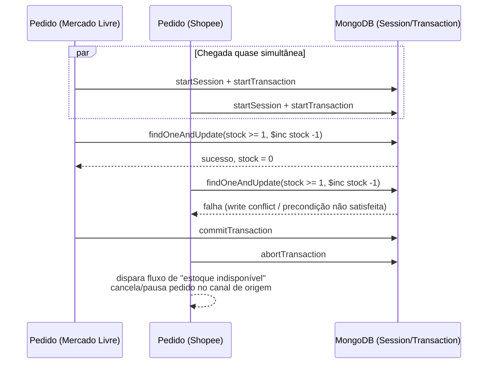
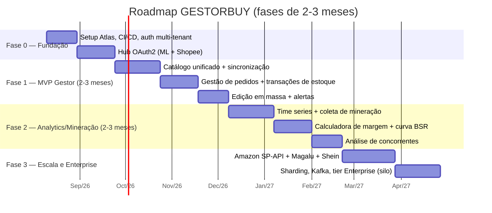

# GESTORBUY — Arquitetura Técnica de um SaaS B2B Multi-Marketplace
### Documento de fundação de engenharia — MongoDB como banco de dados primário

> **Decisão de arquitetura travada:** MongoDB (Atlas) é o banco de dados principal do projeto. Este documento assume essa decisão e projeta toda a modelagem, transações e estratégia de escala em cima dela — não é uma comparação SQL vs. NoSQL.

---

## Sumário

1. [Arquitetura do Sistema e Uso Estratégico do MongoDB](#1-arquitetura-do-sistema-e-uso-estratégico-do-mongodb)
2. [Modelagem de Dados NoSQL](#2-modelagem-de-dados-nosql-mongodb-data-modeling)
3. [Hub de Integração de APIs e Transações](#3-hub-de-integração-de-apis-e-transações)
4. [Módulos do Produto — MVP vs. Fase 2](#4-módulos-do-produto-features-mvp-vs-fase-2)
5. [Roadmap de Desenvolvimento e Desafios de Escala](#5-roadmap-de-desenvolvimento-e-estimativa-de-mvp)

---

## 1. Arquitetura do Sistema e Uso Estratégico do MongoDB

### 1.1 Monolito modular event-driven, não microserviços desde o dia 1

Para um squad inicial (2–6 engenheiros) construindo um MVP em 2–3 meses, microserviços "puros" são dívida técnica antecipada: overhead de deploy, observabilidade distribuída e latência de rede entre serviços que ainda não têm fronteiras de domínio estáveis. A recomendação é um **monolito modular** com um **backbone de eventos assíncrono desde o primeiro dia** — porque a natureza do problema (ingestão de webhooks de 5 marketplaces + polling + rate limits) já é intrinsecamente orientada a eventos, mesmo dentro de um único deploy.



**Por que não Kafka no MVP:** Kafka resolve problemas de replay/ordenação em escala de milhões de eventos/dia com múltiplos consumidores independentes. No MVP, o volume real de webhooks (mesmo com centenas de sellers) fica na casa de milhares/dia. **SQS (se AWS) ou RabbitMQ (se multi-cloud/on-prem)** entregam o essencial — desacoplamento, retry, DLQ — com muito menos overhead operacional. Migração para Kafka é um item explícito da Fase 3 (ver seção 5), quando o volume de eventos e a necessidade de *event sourcing* replayável justificarem.

**Papel dos Change Streams do MongoDB:** em vez de o módulo Analytics fazer polling do banco ou depender só da fila de mensagens, ele assina *Change Streams* nas coleções `products` e `orders`. Isso cria um segundo canal de propagação de eventos **nativo do banco**, útil para:
- Invalidação de cache (Redis) quando um preço muda;
- Disparo de recomputação de métricas (margem, BSR) sem acoplar o módulo Gestor ao Analytics via fila explícita;
- Auditoria/CDC (Change Data Capture) para pipelines de BI externos (ex.: sink para um data warehouse via Atlas Data Federation).

### 1.2 Documentos para payloads heterogêneos entre marketplaces

Esse é o argumento mais forte a favor do MongoDB neste domínio. Cada marketplace retorna um schema de atributos completamente diferente para o "mesmo" conceito de anúncio:

- **Mercado Livre**: `attributes[]` com `id`, `name`, `value_name`, `value_id` (taxonomia própria por categoria), `sale_terms`, `shipping.logistic_type`.
- **Shopee**: `attributes[]` com `attribute_id`, `attribute_value_list[]`, `is_variation`, além de `logistics_info[]` por canal de envio.
- **Amazon SP-API**: XML/JSON profundamente aninhado por `marketplaceId`, com `fulfillment_channel` (FBA vs. FBM) e `condition_type`.

Modelar isso em um schema relacional normalizado exigiria uma tabela EAV (Entity-Attribute-Value) genérica e dolorosa, ou dezenas de colunas nulas por marketplace. No MongoDB, cada documento guarda o **payload nativo do marketplace intacto**, mais uma camada de campos normalizados para consultas cross-marketplace:

```json
{
  "_id": "ObjectId(...)",
  "tenant_id": "seller_8f21a",
  "sku_master": "CAMISA-POLO-AZUL-M",
  "title": "Camisa Polo Azul Tamanho M",
  "unified": {
    "price": 89.90,
    "stock": 42,
    "category_normalized": "vestuario.camisas"
  },
  "channels": {
    "mercado_livre": {
      "item_id": "MLB123456789",
      "status": "active",
      "raw_payload": { "...payload nativo intacto do ML..." }
    },
    "shopee": {
      "item_id": 998877,
      "status": "NORMAL",
      "raw_payload": { "...payload nativo intacto da Shopee..." }
    }
  },
  "updated_at": "ISODate(...)"
}
```

Na prática, isso significa dois níveis de *schema enforcement* na mesma coleção:

1. **Campos "core" com `$jsonSchema` validation estrito** (tenant_id, sku_master, unified.price, unified.stock) — obrigatórios, tipados, validados no nível do banco.
2. **Sub-documentos `channels.<marketplace>.raw_payload` sem validação de shape** — aceitam o que a API do marketplace mandar, versionado por `schema_version` para permitir migrações futuras sem downtime.

### 1.3 MongoDB Time Series Collections para Analytics e histórico de concorrência

Séries temporais (preço/dia, vendas/dia, posição de ranking/dia, estoque/dia) são o caso de uso canônico das *Time Series Collections* introduzidas no MongoDB 5.0+. Comparado a guardar isso em uma coleção comum, o ganho é:

- Armazenamento colunar internamente → **compressão de 70–90%** vs. documentos comuns;
- Índices automáticos otimizados por `time` + `metaField`;
- Consultas de agregação por janela de tempo (`$group` por dia/semana) ordens de magnitude mais rápidas.

```javascript
db.createCollection("price_history", {
  timeseries: {
    timeField: "ts",
    metaField: "metadata",
    granularity: "hours"
  },
  expireAfterSeconds: 31536000 // TTL de 1 ano, opcional
});
```

Exemplo de documento inserido a cada coleta (própria ou de concorrente minerado):

```json
{
  "ts": "ISODate('2026-08-10T03:00:00Z')",
  "metadata": {
    "tenant_id": "seller_8f21a",
    "marketplace": "mercado_livre",
    "item_id": "MLB123456789",
    "is_competitor": false
  },
  "price": 89.90,
  "stock": 42,
  "sold_quantity_cumulative": 1523,
  "visits": 210,
  "position_in_category": 4
}
```

Isso alimenta diretamente o módulo estilo Avant Pro (seção 2.2 e 4) sem precisar de um data warehouse separado no MVP — o Atlas resolve OLTP + séries temporais no mesmo cluster, adiando a necessidade de um pipeline de BI dedicado.

### 1.4 Estratégia para Rate Limits rígidos das APIs de marketplace

Cada marketplace tem sua própria política (ML: ~sliding window por aplicação; Shopee: quota por endpoint/loja; Amazon SP-API: *token bucket* declarado explicitamente nos headers de resposta). A estratégia precisa ser **por credencial de tenant**, não global, e sobreviver a múltiplas instâncias do worker rodando em paralelo (rate limiting distribuído).



- **Redis** faz o rate limiting em tempo real (baixa latência, contadores atômicos via Lua script) — é a fonte de verdade operacional.
- **MongoDB** guarda o *estado observado* (`quota_restante`, `reset_at`, `last_429_at` por `tenant_id + marketplace`) em uma coleção com **TTL index**, para auditoria, dashboards de saúde de integração e decisões de *circuit breaker* (pausar sync automático de um tenant que está sistematicamente tomando 429/403).
- Toda chamada de API passa por uma fila dedicada por par `(tenant, marketplace)` com concorrência limitada — isso evita que um tenant "barulhento" (ex.: catálogo de 50 mil SKUs) esgote a cota e prejudique o *fair share* de outros tenants na mesma aplicação (problema central em multi-tenancy).

---

## 2. Modelagem de Dados NoSQL (MongoDB Data Modeling)

### 2.1 Coleção `products` — anúncios unificados com variações e multi-marketplace

Decisão de modelagem: **um documento por produto-mestre** (SKU pai), com variações embutidas (array) e um sub-documento por canal de venda. Embedding é preferível a referenciamento aqui porque variações e canais são sempre lidos e escritos junto com o produto pai (padrão de acesso "tudo ou nada"), e o volume por documento (dezenas de variações × 5 marketplaces) fica confortavelmente abaixo do limite de 16MB por documento.

```json
{
  "_id": "ObjectId('...')",
  "tenant_id": "seller_8f21a",
  "sku_master": "CAMISA-POLO",
  "title": "Camisa Polo Premium",
  "brand": "MarcaX",
  "category_normalized": "vestuario.camisas.polo",
  "variations": [
    {
      "variation_sku": "CAMISA-POLO-AZUL-M",
      "attributes": { "cor": "azul", "tamanho": "M" },
      "stock_total": 42,
      "cost_price": 32.50
    },
    {
      "variation_sku": "CAMISA-POLO-AZUL-G",
      "attributes": { "cor": "azul", "tamanho": "G" },
      "stock_total": 18,
      "cost_price": 32.50
    }
  ],
  "channels": {
    "mercado_livre": {
      "item_id": "MLB123456789",
      "status": "active",
      "listing_type": "gold_special",
      "price_override": 99.90,
      "sync_status": "synced",
      "last_synced_at": "ISODate('2026-08-10T02:00:00Z')",
      "raw_payload": { "...": "..." }
    },
    "shopee": {
      "item_id": 998877,
      "status": "NORMAL",
      "price_override": 94.90,
      "sync_status": "pending",
      "last_synced_at": "ISODate('2026-08-09T22:00:00Z')",
      "raw_payload": { "...": "..." }
    }
  },
  "stock_strategy": "shared_pool",
  "created_at": "ISODate('...')",
  "updated_at": "ISODate('...')"
}
```

Pontos de design deliberados:

- **`stock_strategy: "shared_pool"`** vs `"per_channel"` — o tenant escolhe se o estoque é um pool único sincronizado em todos os canais (mais comum, e o motivo pelo qual transações ACID importam — seção 3.2) ou se aloca estoque fixo por canal (útil quando o seller quer proteger o Mercado Livre de ficar sem estoque por causa de uma venda relâmpago na Shopee).
- **`price_override` por canal**: preço-base fica em `variations[].cost_price` (custo) e o preço de venda é uma decisão por canal (a margem varia por comissão de cada marketplace — insumo direto da calculadora de margem real do módulo Analytics).
- **`raw_payload` não normalizado**: preserva 100% da resposta original da API para debug, reprocessamento e para não perder atributos específicos do marketplace que ainda não mapeamos para `unified`.

### 2.2 Coleção de mineração estilo Avant Pro — histórico de vendas/BSR

Separada da `products` porque tem um padrão de escrita e retenção completamente diferente: alto volume de *inserts* (coleta periódica), quase nenhum *update*, e consultas majoritariamente por range de tempo. Como discutido em 1.3, isso vai para uma **Time Series Collection**, mas o "documento de identidade" do produto minerado (título, marketplace, categoria, vendedor concorrente) fica em uma coleção normal de referência:

```json
// coleção: mined_products (metadados, baixo volume de escrita)
{
  "_id": "ObjectId('...')",
  "marketplace": "mercado_livre",
  "item_id": "MLB987654321",
  "title": "Fone Bluetooth XPTO",
  "seller_id": "ML_SELLER_5521",
  "category_path": "eletronicos.audio.fones",
  "first_seen_at": "ISODate('2026-06-01T00:00:00Z')",
  "tracked_by_tenants": ["seller_8f21a", "seller_c910b"],
  "current_snapshot": {
    "price": 79.90,
    "sold_quantity_total": 15420,
    "rating": 4.7,
    "reviews_count": 892
  }
}
```

```json
// time series: mined_metrics_daily (alto volume de escrita)
{
  "ts": "ISODate('2026-08-10T00:00:00Z')",
  "metadata": { "item_id": "MLB987654321", "marketplace": "mercado_livre" },
  "price": 79.90,
  "sold_quantity_day": 47,
  "revenue_estimated_day": 3755.30,
  "bsr_category": 12,
  "stock_estimated": 340
}
```

A "curva de BSR" e o "faturamento estimado/dia" (marca registrada de ferramentas como Avant Pro/Gestor Seller) são então uma agregação `$group` sobre `mined_metrics_daily` filtrando por `metadata.item_id` e um range de `ts` — exatamente o padrão de consulta para o qual Time Series Collections foram desenhadas.

### 2.3 Estratégia de Multi-tenancy: Shared DB com discriminator + Silo para Enterprise



**Recomendação: modelo híbrido, não uma escolha binária.**

| Critério | Shared DB + Discriminator Field | Database/Cluster per Tenant |
|---|---|---|
| Custo operacional | Baixo — um cluster serve milhares de tenants | Alto — overhead por cluster (Atlas cobra por cluster) |
| Isolamento de dados | Lógico (aplicação + regras de acesso) | Físico (garantido pela infraestrutura) |
| Blast radius de bug | Um bug de filtro pode vazar dados entre tenants | Impossível vazar entre bancos distintos |
| Ruído de performance | Tenant grande pode impactar outros (noisy neighbor) | Isolado, previsível |
| Adequado para | 95% da base (PMEs, sellers pequenos/médios) | Contas enterprise com exigência contratual de isolamento físico, ou tenants com volume desproporcional |

Para o MVP e a maioria da base de clientes (sellers pequenos e médios), **shared database com `tenant_id` como discriminator em toda coleção** é a escolha correta — reduz custo de Atlas em ordens de grandeza e é operacionalmente mais simples de fazer backup, monitorar e escalar. O modelo silo (cluster dedicado) fica reservado como **tier Enterprise pago à parte**, ativado quando o contrato exigir isolamento físico (comum em auditorias de segurança de grandes redes de varejo) — a mesma base de código funciona para os dois, só muda a *connection string* resolvida pelo tenant router.

**Garantias de isolamento no modelo compartilhado (defesa em profundidade):**

1. **Nunca confiar em filtro manual espalhado pelo código.** Todo acesso a dado passa por um *repository layer* que injeta `tenant_id` automaticamente a partir do contexto de autenticação — nenhuma query "solta" no código de aplicação.
2. **`$jsonSchema` validation exige `tenant_id`** em toda coleção sensível — o próprio MongoDB rejeita o insert de um documento sem esse campo.
3. **Índice composto `{ tenant_id: 1, ... }` como prefixo de todo índice** — isolamento também vira otimização de performance (ver 2.4).
4. **Row-Level Security equivalente via Views + `$expr`**, para camadas de leitura (ex.: BI/relatórios) que não devem ter acesso a `tenant_id` alheio, mesmo em caso de bug de aplicação.
5. **Auditoria**: toda operação de escrita loga `tenant_id + user_id + collection + operation` em uma coleção de auditoria com TTL, permitindo detectar acesso cross-tenant anômalo.

### 2.4 Índices essenciais

```javascript
// Compound index: toda query de listagem de produtos é sempre por tenant primeiro
db.products.createIndex({ tenant_id: 1, "channels.mercado_livre.item_id": 1 });
db.products.createIndex({ tenant_id: 1, sku_master: 1 }, { unique: true });
db.products.createIndex({ tenant_id: 1, "unified.stock": 1 }); // alertas de ruptura

// Text index: busca de anúncios por título/marca (autocomplete e busca interna)
db.products.createIndex(
  { title: "text", brand: "text", sku_master: "text" },
  { weights: { title: 10, brand: 5, sku_master: 3 }, default_language: "portuguese" }
);

// TTL index: cache de respostas de API (evita nova chamada dentro da janela de validade)
db.api_response_cache.createIndex({ expires_at: 1 }, { expireAfterSeconds: 0 });

// TTL index: logs de webhook bruto (retenção de 30 dias, depois só o processado permanece)
db.webhook_raw_logs.createIndex({ received_at: 1 }, { expireAfterSeconds: 2592000 });

// TTL index: estado de rate limit observado (seção 1.4)
db.rate_limit_state.createIndex({ updated_at: 1 }, { expireAfterSeconds: 3600 });

// Compound index para o hub de pedidos: consulta mais comum é status + tenant + data
db.orders.createIndex({ tenant_id: 1, status: 1, created_at: -1 });
```

Regra prática adotada: **todo índice composto em coleção multi-tenant começa com `tenant_id`**, o que faz o MongoDB usar esse índice como filtro de isolamento *e* de performance simultaneamente — uma query sem `tenant_id` no filtro nem consegue usar índice eficientemente, o que serve como uma segunda camada (acidental, mas útil) de proteção contra bugs de vazamento.

---

## 3. Hub de Integração de APIs e Transações

### 3.1 OAuth2, renovação de tokens e criptografia de campo (CSFLE/Queryable Encryption)

Tokens de acesso e refresh tokens são o ativo mais sensível do sistema — um vazamento dá a um atacante controle total sobre a conta do seller no marketplace (alterar preços, redirecionar pedidos). A estratégia:

1. **OAuth2 Authorization Code Flow** por marketplace, com `refresh_token` de longa duração armazenado e `access_token` de curta duração mantido primariamente em cache (Redis), nunca persistido em texto puro no banco de longo prazo.
2. **Client-Side Field Level Encryption (CSFLE)** ou, preferencialmente em clusters Atlas mais recentes, **Queryable Encryption** para os campos `refresh_token`, `client_secret` e `access_token` quando persistidos:

```json
{
  "tenant_id": "seller_8f21a",
  "marketplace": "mercado_livre",
  "refresh_token": "Binary(subtype 6, ciphertext...)",
  "access_token": "Binary(subtype 6, ciphertext...)",
  "expires_at": "ISODate('2026-08-10T04:00:00Z')",
  "scopes": ["read", "write", "offline_access"],
  "connected_at": "ISODate('...')"
}
```

```javascript
// Definição do schema de criptografia (aplicado na criação da coleção)
{
  "credentials.refresh_token": {
    "bsonType": "string",
    "queries": { "queryType": "equality" } // Queryable Encryption: permite lookup sem decifrar tudo
  },
  "credentials.access_token": {
    "bsonType": "string"
  }
}
```

- As chaves de criptografia (Data Encryption Keys) ficam num **Key Vault** dedicado no próprio Atlas, protegido por um **KMS externo** (AWS KMS, GCP KMS ou Azure Key Vault) — a aplicação nunca tem acesso direto à *Customer Master Key*.
- **Renovação automática de token**: um worker dedicado (`token-refresher`) roda em intervalo curto, identifica tokens a expirar nos próximos N minutos (`expires_at < now + 10min`) via índice, executa o *refresh flow* do marketplace e atualiza o documento — sempre criptografando antes de persistir. Falha de refresh dispara notificação ao tenant (reconexão manual necessária) e marca a integração como `status: "reauth_required"`.

### 3.2 ACID Transactions para "zero furo de estoque"

O cenário crítico: o mesmo SKU tem estoque compartilhado (`stock_strategy: "shared_pool"`, seção 2.1) entre Mercado Livre, Shopee e Amazon. Dois pedidos chegam quase simultaneamente de canais diferentes para o último item em estoque. Sem controle transacional, ambos passam na checagem de estoque e o seller vende o mesmo item duas vezes — o pior cenário operacional em e-commerce multicanal.

MongoDB, desde a versão 4.0 (multi-documento) e com o modelo de documento já reduzindo boa parte da necessidade de transações multi-coleção, resolve isso com **sessions + transactions** ACID:



```javascript
const session = client.startSession();

try {
  await session.withTransaction(async () => {
    const variation = await db.collection("products").findOneAndUpdate(
      {
        tenant_id: tenantId,
        "variations.variation_sku": variationSku,
        "variations.$.stock_total": { $gte: quantity } // pré-condição atômica
      },
      { $inc: { "variations.$.stock_total": -quantity } },
      { session, returnDocument: "after" }
    );

    if (!variation.value) {
      throw new InsufficientStockError(variationSku);
    }

    await db.collection("orders").insertOne(
      {
        tenant_id: tenantId,
        marketplace: order.marketplace,
        external_order_id: order.externalId,
        items: order.items,
        stock_reserved: true,
        status: "confirmed",
        created_at: new Date()
      },
      { session }
    );

    // Enfileira job de sincronização de estoque para os OUTROS canais
    await db.collection("stock_sync_queue").insertOne(
      { tenant_id: tenantId, variation_sku: variationSku, delta: -quantity },
      { session }
    );
  }, {
    readConcern: { level: "snapshot" },
    writeConcern: { w: "majority" }
  });
} catch (err) {
  if (err instanceof InsufficientStockError) {
    // fluxo de compensação: notificar seller, cancelar/segurar pedido no marketplace de origem
  }
  throw err;
} finally {
  await session.endSession();
}
```

Pontos importantes de design:

- **`readConcern: "snapshot"` + `writeConcern: "majority"`** garante isolamento serializável entre as duas transações concorrentes — exatamente a garantia ACID necessária aqui.
- A checagem de estoque **é parte da mesma operação atômica** que o decremento (`$gte: quantity` na query de update), não um `read` seguido de `write` separado — isso elimina a *race condition* clássica de "check-then-act".
- A propagação para os outros canais (Mercado Livre e Amazon, no exemplo) **não acontece dentro da transação** (chamada de API externa dentro de uma transação de banco é antipadrão — pode travar a transação por segundos). Em vez disso, a transação apenas grava a intenção (`stock_sync_queue`) de forma atômica junto com o pedido; um worker assíncrono consome essa fila e faz as chamadas de API reais com retry/backoff — mantendo o *shared pool* de estoque eventualmente consistente entre canais, mas com a garantia forte de que o **estoque interno nunca vende em duplicidade**.
- Transações no MongoDB têm custo de performance; por isso o escopo é deliberadamente mínimo (só as duas escritas que precisam de atomicidade), não um wrapper genérico em todo o fluxo de pedido.

---

## 4. Módulos do Produto (Features MVP vs. Fase 2)

### 4.1 Módulo Gestor (gestão operacional multicanal)

| Feature | MVP | Fase 2 |
|---|:---:|:---:|
| Conexão OAuth2 com ML, Shopee, Amazon | ✅ | |
| Conexão OAuth2 com Magalu, Shein | | ✅ |
| Catálogo unificado de produtos/variações | ✅ | |
| Edição em massa de preço/estoque (bulk) | ✅ | |
| Controle de estoque unificado (shared pool) | ✅ | |
| Estoque segmentado por canal (per-channel) | | ✅ |
| Gestão centralizada de pedidos (hub único) | ✅ | |
| Impressão de etiqueta/nota em lote | | ✅ |
| Regras de precificação automática (regras simples: markup fixo por canal) | ✅ | |
| Precificação dinâmica baseada em concorrência (auto-reprice) | | ✅ |
| Alertas de ruptura de estoque | ✅ | |
| Gestão de devoluções/reclamações (pós-venda) | | ✅ |

### 4.2 Módulo Analytics / estilo Avant Pro

| Feature | MVP | Fase 2 |
|---|:---:|:---:|
| Mineração de produto por palavra-chave/categoria (1 marketplace) | ✅ | |
| Mineração multi-marketplace simultânea | | ✅ |
| Curva histórica de vendas/dia e faturamento estimado | ✅ | |
| Curva de BSR/ranking na categoria | ✅ | |
| Calculadora de margem real (taxas + frete + imposto + custo) | ✅ | |
| Análise de concorrentes diretos (tracking manual de até N itens) | ✅ | |
| Descoberta automática de concorrentes (via categoria/atributos) | | ✅ |
| SEO de anúncio (sugestão de título/keywords por densidade de busca) | | ✅ |
| Score de saúde do anúncio (completude, imagem, reputação) | | ✅ |
| Benchmarking de nicho (score de saturação/oportunidade) | | ✅ |
| Dashboards white-label para agências que gerenciam múltiplos sellers | | ✅ |

A lógica de corte MVP vs. Fase 2 segue um critério único: **tudo que depende de dado próprio do tenant (estoque, preço, pedidos, custo) entra no MVP**; **tudo que depende de agregação em larga escala de dados de terceiros (descoberta automática de concorrentes, SEO por densidade de busca no marketplace inteiro) fica para a Fase 2**, porque exige volume de mineração e maturidade de infraestrutura de scraping/API que o MVP ainda não tem.

---

## 5. Roadmap de Desenvolvimento e Estimativa de MVP



| Fase | Duração | Entregável central | Marco de validação |
|---|---|---|---|
| **Fase 0 — Fundação** | 4–6 semanas | Multi-tenancy, autenticação, hub OAuth2 com ML e Shopee funcionando end-to-end | Um seller real consegue conectar sua conta e ver o catálogo importado |
| **Fase 1 — MVP Gestor** | 2–3 meses | Catálogo unificado, edição em massa, pedidos centralizados, controle de estoque com transações ACID | Zero furo de estoque validado em teste de carga com pedidos concorrentes simulados |
| **Fase 2 — Analytics/Mineração** | 2–3 meses | Time series de preço/venda, calculadora de margem, curva de BSR, tracking de concorrentes | Precisão da estimativa de faturamento validada contra dados reais de um piloto |
| **Fase 3 — Escala/Enterprise** | contínuo | Amazon, Magalu, Shein; sharding; tier Enterprise com cluster dedicado | Cluster suporta N tenants com SLA de latência sob carga real |

### 5.1 Desafios operacionais do MongoDB em larga escala

**Sharding.** A chave de shard correta aqui é composta: `{ tenant_id: "hashed" }` para distribuição uniforme de escrita entre shards (evita *hot shard* quando um tenant grande concentra tráfego), combinada com **zone sharding** para o modelo híbrido de multi-tenancy da seção 2.3 — tenants Enterprise podem ser roteados para zonas/shards dedicados sem sair do mesmo cluster lógico, uma alternativa intermediária ao cluster totalmente isolado quando o custo de um cluster dedicado ainda não se justifica.

**Change Streams em produção.** Necessário monitorar *resume tokens* (para retomar um stream após queda do worker sem perder eventos) e ter um plano de *backpressure* — se o consumidor do Change Stream (ex.: o módulo Analytics) cair por minutos, o *oplog window* do cluster precisa ser grande o suficiente para reter os eventos até a retomada, ou o stream perde eventos silenciosamente. Isso é dimensionado via `oplogMinRetentionHours` no Atlas.

**Custos no Atlas.** Os três drivers de custo a monitorar desde o MVP:
- **Tier de cluster** (M10/M20 cobrem o MVP; M30+ quando volume de escrita de webhooks crescer);
- **Armazenamento de Time Series** — apesar de mais compactas, coleções de mineração em escala (milhares de itens monitorados × granularidade horária) crescem rápido; TTL agressivo (12–18 meses) e agregação para granularidade diária após N dias controla isso;
- **Data transfer** — Change Streams e réplicas cross-region custam tráfego; manter workers de leitura na mesma região do cluster primário evita custo de egress desnecessário.

---

## Decisões de arquitetura resumidas

| Decisão | Escolha |
|---|---|
| Banco de dados principal | **MongoDB Atlas** |
| Arquitetura de aplicação | Monolito modular, event-driven internamente |
| Message broker (MVP) | SQS ou RabbitMQ — Kafka adiado para Fase 3 |
| Multi-tenancy | Shared DB + `tenant_id` discriminator (padrão) / cluster dedicado (Enterprise) |
| Analytics/histórico | MongoDB Time Series Collections |
| Segurança de credenciais | OAuth2 + CSFLE/Queryable Encryption + KMS externo |
| Consistência de estoque | ACID Transactions (Sessions) no MongoDB, escopo mínimo |
| Rate limiting | Redis (tempo real) + MongoDB TTL (estado observado/auditoria) |
